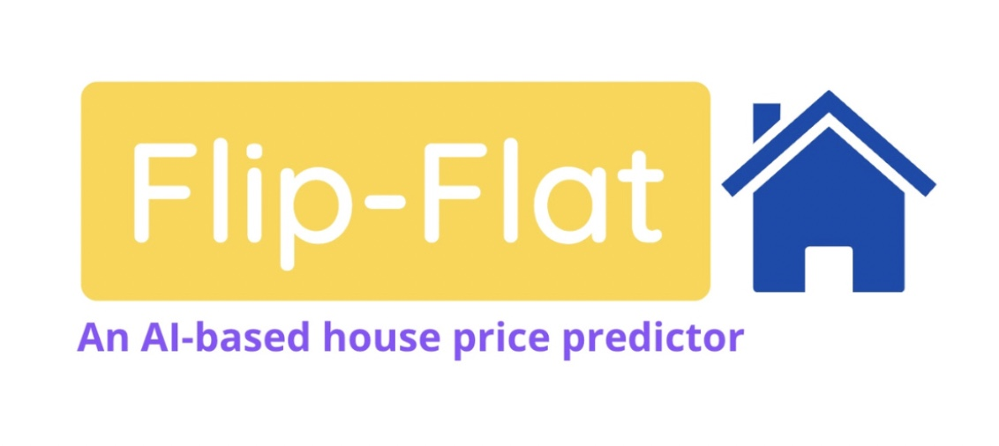

# Flip Flat

## Overview
This project aims to address the challenge of accurately predicting real estate pricing using data science techniques. Focused on the real estate market, it leverages extensive data collection and advanced predictive modeling to provide insights into property valuation. Model was deployed in streamlit.

Click **[here](https://miguelpalospou-final-project-home-0wdr08.streamlit.app/)** to access the deployed platform.

## Table of Contents
- [Flip Flat](#project-title)
- [Overview](#overview)
- [Table of Contents](#table-of-contents)
- [Data Collection](#data-collection)
- [Data Processing](#data-processing)
- [Data Analysis & Visualization](#data-analysis--visualization)
- [Predictive Modeling](#predictive-modeling)
- [Deployment](#deployment)
- [Future Work](#future-work)
- [Installation](#installation)
- [Usage](#usage)

## Data Collection
Data was extensively collected through web scraping, targeting over 3,000 houses across multiple regions in Barcelona. The primary tools used for this purpose were BeautifulSoup, Selenium, and an undetected Chrome driver, with dynamic IP management to avoid detection and ensure efficient data collection.

## Data Processing
Scraped data was cleaning on python, handling missing values, and transforming the data into a format suitable for analysis. For more info check cleaning.py file located in src folder.

## Data Analysis & Visualization
Data exploration was donde in Tableau and Python to uncover patterns, trends, and correlations. 

## Predictive Modeling
The predictive model was developed with certain assumptions, such as treating properties without listed parking as having "no parking," focusing on flat types only, and removing outliers (properties priced over 1 million EUR). The model was trained with an 80/20 train/test split, achieving a mean absolute error of 78,039.1 and an r2 score of 0.76.

## Deployment
Deployement was done on Streamlit, making the predictive model accessible for real-time predictions.

## Future Work
Future enhancements include improving model accuracy through techniques such as automated real-time scraping for more up-to-date data, incorporating additional variables (e.g., bathrooms, flat conditions), and experimenting with model parameters. There is also an interest in expanding the service by creating detailed dashboards for flat searches, developing an application, and including other features to enhance user experience.

## Installation
libraries needed: pandas, numpy, scikit-learn, BeautifulSoup, Selenium, etc.

## Usage

